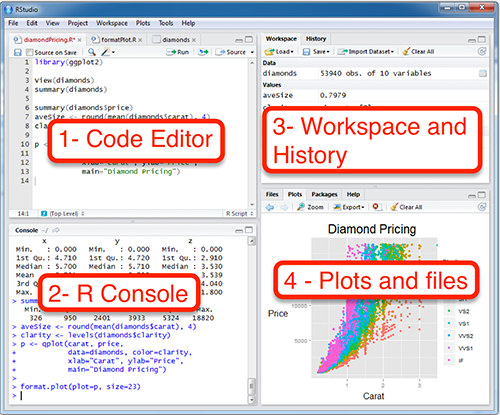

```{r}
#| include: false
library(knitr)
knitr::opts_chunk$set(echo = F,
                      warning = F,
                      error = F, 
                      message = F) 
```

```{r}
#| include: false

if (! require("pacman")) install.packages("pacman")

pacman::p_load(tidyverse, 
               here,
               kableExtra)

options(scipen=999)
rm(list = ls())
```


::: columns
::: {.column width="25%"}
{width="100%"}
  </br></br>
{width="95%"}

:::

::: {.column .column-right width="75%"}

::: {style="font-size:25px; text-align:right; line-height:1.1;"}

**Licenciatura en Estudios Internacionales**

:::
::: {style="font-size:40px; text-align:right; line-height:1.1; margin-top:12px;"}

**Taller de Estadística: Introducción a R**
:::
------------------------------------------------------------------------
</br>

::: {style="text-align:right;"}

**Prof. René Canales**
:::

::: {.blue2 .medium style="font-size:28px;line-height:0.4; margin-top:0; margin-bottom:0; text-align:right;"}

Asistente de Investigación FONDECYT 1250518 

Bremen International Graduate School of Social Sciences (BIGSSS) </br> Universität Bremen </br>

Asistente de Investigación FONDECYT 1250518

:::

</br>

### Universidad de Santiago de Chile, Abril 2026 {style="color:black; text-align:right; font-size:30px;"}

:::
:::

## Contenidos del taller {background-color="#f8f9fa"}

::: {.columns}
::: {.column width="50%"}
### Parte I
- ¿Qué es R y por qué usarlo?
- ¿Qué es RStudio?
- Componentes de la interfaz
- Instalación y configuración
:::
::: {.column width="50%"}
### Parte II
- Objetos y tipos de datos
- Variables
- Bases de datos (data frames)
- Operaciones básicas
:::
:::

---

## ¿Qué es R? {background-color="#f8f9fa"}

::: {.columns}
::: {.column width="55%"}
R es un **lenguaje de programación estadística** de código abierto, diseñado para:

- Análisis estadístico y modelamiento
- Visualización de datos
- Investigación reproducible
- Ciencia de datos

::: {.callout-note}
R es **gratuito**, multiplataforma y tiene una comunidad académica muy activa.
:::
:::
::: {.column width="45%"}
{width=60% fig-align="center"}

**Creado por:** Ross Ihaka y Robert Gentleman (1993)  
**Versión actual:** R 4.x
:::
:::

---

## ¿Qué es RStudio? {background-color="#f8f9fa"}

RStudio es un **entorno de desarrollo integrado (IDE)** que hace R más fácil de usar.

::: {.columns}
::: {.column width="50%"}
**R** es el motor 🔧  
**RStudio** es el tablero de control 🖥️

> Puedes usar R sin RStudio, pero RStudio **no funciona sin R**.
:::
::: {.column width="50%"}
**Ventajas de RStudio:**

- Interfaz visual amigable
- Autocompletado de código
- Integración con Git
- Soporte para Quarto/R Markdown
- Gestión de proyectos
:::
:::

---

## Componentes de RStudio {background-color="#f8f9fa"}

La interfaz de RStudio tiene **4 paneles principales:**

::: {.columns}
::: {.column width="48%"}
**① Script / Editor**  
Donde escribes y guardas tu código R.

**② Consola (Console)**  
Donde se ejecuta el código y ves los resultados.

**③ Entorno (Environment)**  
Muestra los objetos y variables activos.

**④ Panel Inferior Derecho**  
Archivos, Gráficos, Paquetes y Ayuda.
:::
::: {.column width="50%"}
 
:::
:::


---

## Primeros pasos en R {background-color="#f8f9fa"}

R puede usarse como una calculadora directamente en la consola:

```r
# Operaciones básicas
2 + 3        # Suma → 5
10 - 4       # Resta → 6
3 * 7        # Multiplicación → 21
15 / 4       # División → 3.75
2 ^ 8        # Potencia → 256
sqrt(144)    # Raíz cuadrada → 12
```

::: {.callout-tip}
Todo lo que va después de `#` es un **comentario** y R lo ignora. ¡Úsalos para documentar tu código!
:::

---

## Objetos en R {background-color="#f8f9fa"}

En R, todo es un **objeto**. Los objetos almacenan información y tienen un tipo.

```r
# Crear un objeto numérico
edad <- 25

# Objeto de texto (character)
nombre <- "René"

# Objeto lógico (logical)
es_estudiante <- TRUE

# Ver el tipo de un objeto
class(edad)         # "numeric"
class(nombre)       # "character"
class(es_estudiante) # "logical"
```

::: {.callout-important}
El operador `<-` se usa para **asignar valores** a objetos (también puedes usar `=`).
:::

---

## Tipos de datos principales {background-color="#f8f9fa"}

| Tipo | Descripción | Ejemplo |
|------|-------------|---------|
| `numeric` | Números reales | `3.14`, `100` |
| `integer` | Números enteros | `1L`, `42L` |
| `character` | Texto | `"hola"`, `"Bremen"` |
| `logical` | Verdadero/Falso | `TRUE`, `FALSE` |
| `factor` | Categorías | `factor("alto", "bajo")` |
| `NA` | Valor faltante | `NA` |

```r
# Verificar tipos
is.numeric(3.14)      # TRUE
is.character("hola")  # TRUE
is.logical(FALSE)     # TRUE
```

---

## Variables en R {background-color="#f8f9fa"}

Una **variable** es un nombre que apunta a un objeto almacenado en memoria.

```r
# Asignación de variables
x <- 10
y <- 5

# Operaciones con variables
suma   <- x + y    # 15
resta  <- x - y    # 5
doble  <- x * 2    # 20

# Ver todas las variables activas
ls()

# Eliminar una variable
rm(x)
```

::: {.callout-tip}
Usa nombres **descriptivos**: `edad_promedio` es mejor que `ep` o `var1`.
:::

---

## Vectores {background-color="#f8f9fa"}

El **vector** es la estructura de datos más básica en R: una secuencia de elementos del mismo tipo.

```r
# Crear vectores con c()
edades   <- c(23, 31, 28, 25, 19)
nombres  <- c("Ana", "Luis", "María", "Pedro", "Carla")
activos  <- c(TRUE, FALSE, TRUE, TRUE, FALSE)

# Acceder a elementos (índice desde 1)
edades[1]       # 23 (primer elemento)
edades[2:4]     # 31 28 25 (elementos 2 al 4)
nombres[c(1,3)] # "Ana" "María"

# Operaciones sobre vectores
mean(edades)    # Promedio → 25.2
sum(edades)     # Suma → 126
length(edades)  # Cantidad de elementos → 5
```

---

## Bases de datos: Data Frames {background-color="#f8f9fa"}

Un **data frame** es una tabla de datos donde cada columna es una variable y cada fila es una observación.

```r
# Crear un data frame
estudiantes <- data.frame(
  nombre = c("Ana", "Luis", "María", "Pedro"),
  edad   = c(23, 31, 28, 25),
  nota   = c(6.5, 5.8, 6.9, 6.1),
  activo = c(TRUE, FALSE, TRUE, TRUE)
)

# Explorar el data frame
head(estudiantes)      # Primeras 6 filas
str(estudiantes)       # Estructura
dim(estudiantes)       # Dimensiones (filas, columnas)
nrow(estudiantes)      # N° filas → 4
ncol(estudiantes)      # N° columnas → 4
```

---

## Acceder a datos en un Data Frame {background-color="#f8f9fa"}

```r
# Por nombre de columna (con $)
estudiantes$nombre     # Vector de nombres
estudiantes$edad       # Vector de edades

# Por posición [fila, columna]
estudiantes[1, ]       # Primera fila completa
estudiantes[, 2]       # Segunda columna completa
estudiantes[2, 3]      # Fila 2, Columna 3 → 5.8

# Filtrar filas con condiciones
estudiantes[estudiantes$activo == TRUE, ]
estudiantes[estudiantes$nota >= 6.5, ]

# Estadísticas por columna
mean(estudiantes$nota)   # Promedio de notas
summary(estudiantes)     # Resumen estadístico
```

---

## Importar datos externos {background-color="#f8f9fa"}

En la práctica, cargaremos datos desde archivos externos:

```r
# CSV (comma-separated values)
datos <- read.csv("mi_archivo.csv")

# Con separador punto y coma (común en Europa/LatAm)
datos <- read.csv2("mi_archivo.csv")

# Excel (requiere paquete readxl)
# install.packages("readxl")
library(readxl)
datos <- read_excel("mi_archivo.xlsx")

# Ver los primeros registros
head(datos)
summary(datos)
```

::: {.callout-tip}
Usa **Proyectos de RStudio** para mantener organizados tus archivos y rutas de trabajo.
:::

---

## Paquetes en R {background-color="#f8f9fa"}

Los **paquetes** son colecciones de funciones que extienden las capacidades de R.

```r
# Instalar un paquete (solo una vez)
install.packages("tidyverse")

# Cargar un paquete (cada sesión)
library(tidyverse)

# Paquetes esenciales para comenzar:
install.packages(c(
  "tidyverse",   # Manipulación y visualización de datos
  "readxl",      # Leer archivos Excel
  "janitor",     # Limpieza de datos
  "skimr"        # Resúmenes estadísticos
))
```

# {background-color="#53AFDA"}

::: title-box
<h2 class="title-main" style="font-size: 2em;">¡Gracias!</h2>
<p class="title-inst" style="margin-top: 1em;">¿Preguntas?</p>
<hr class="title-hr"/>
<p class="title-author">René Canales</p>
<p class="title-date">rene.canales@usach.cl</p>
<p class="title-date">Github: [https://github.com/renejcanales/estadistica_usach](https://github.com/renejcanales/estadistica_usach)</p>
:::
